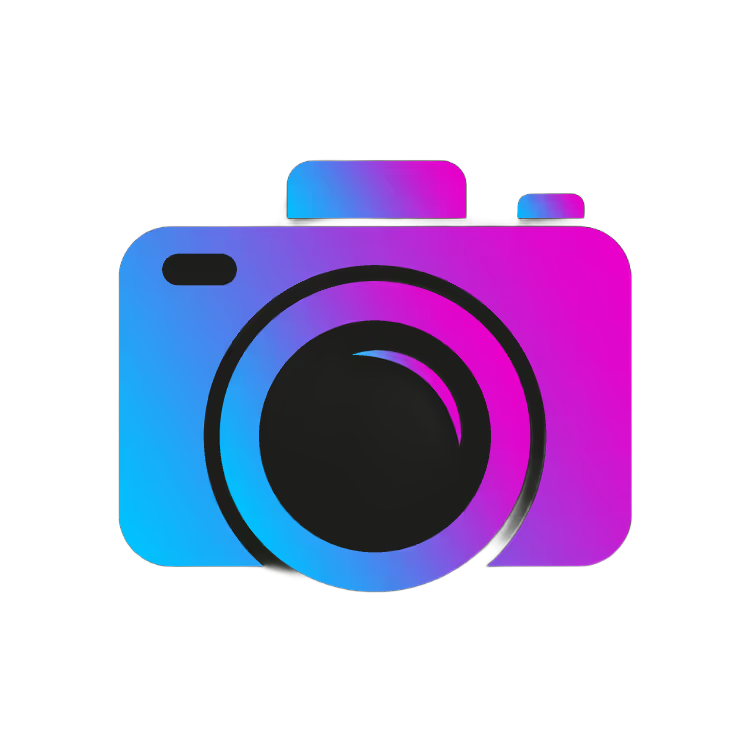
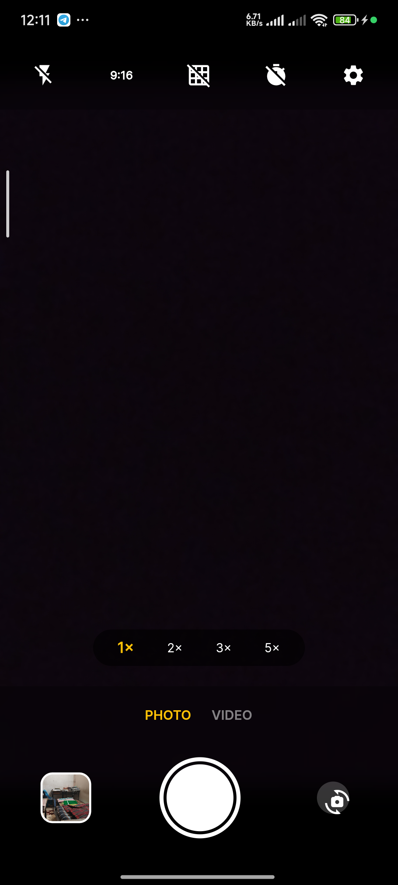
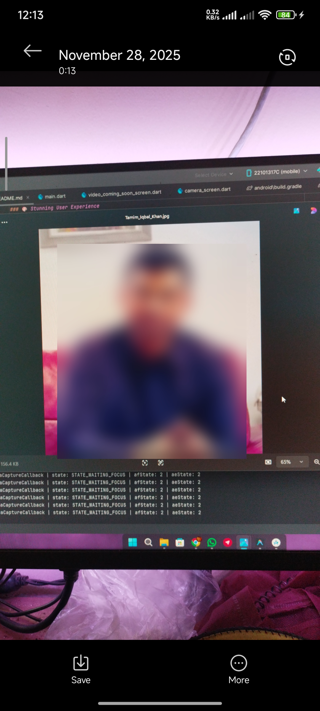

<div align="center">

  <!-- You can replace this with your actual logo path -->
  

  # 📸 AI Camera Pro

  **The Future of Mobile Photography is Here.**
  
  [](https://flutter.dev/)
  [](https://dart.dev/)
  [](https://www.tensorflow.org/lite)
  [](https://www.android.com/)
  [](LICENSE)

  <p>
    <a href="#-features">Features</a> •
    <a href="#-how-it-works">How It Works</a> •
    <a href="#-installation">Installation</a> •
    <a href="#-roadmap">Roadmap</a>
  </p>
</div>

---

## 🚀 Overview

**AI Camera Pro** isn't just another camera app. It's an intelligent photography assistant that understands what it sees. Built with **Flutter** and powered by on-device **TensorFlow Lite**, it brings advanced computer vision capabilities directly to your pocket—offline and privacy-focused.

Whether you're looking to automatically blur backgrounds for that DSLR look, remove photobombers, or simply capture high-quality photos with smart orientation handling, AI Camera Pro has you covered.

---

## ✨ Key Features

### 🧠 Advanced AI Capabilities
- **Real-Time Object Detection**: Identifies up to 80 different types of objects (People, Cars, Pets, etc.) instantly using the YOLOv8 Nano model.
- **Privacy Mode**: Automatically detects faces/bodies and applies a dynamic blur to protect identity.
- **Smart Eraser (Beta)**: Selectively remove detected objects from your scene before you even take the shot.

### � Professional Photography Tools
- **Intelligent Aspect Ratio**:
  - **Portrait (3:4)**: Perfect for social media.
  - **Landscape (4:3)**: Automatically detects device rotation and adjusts the sensor crop for wide cinematic shots.
  - **Full Screen (16:9)**: Immersive capture experience.
- **Pro Controls**:
  - **Manual Focus**: Tap-to-focus with auto-exposure locking.
  - **Zoom Slider**: Smooth digital zoom up to 8x.
  - **Grid Lines**: Rule of thirds overlay for perfect composition.
  - **Flash Control**: Torch, Auto, and Always-On modes.

### 🎨 Stunning User Experience
- **Glassmorphism UI**: A modern, translucent interface that adapts to your environment.
- **Haptic Feedback**: Subtle vibrations for shutter and interaction confirmation.
- **Instant Gallery**: Built-in high-performance gallery with zoom and share capabilities.

---

## �️ How It Works

1.  **Camera Stream**: The app captures a raw video stream from the device camera using the `camera` package.
2.  **Frame Analysis**: Every few milliseconds, a frame is sent to the **TensorFlow Lite** interpreter running in a background isolate to prevent UI lag.
3.  **YOLO Inference**: The **YOLO (You Only Look Once)** model analyzes the frame and returns bounding boxes for detected objects.
4.  **Overlay Drawing**: The UI draws these bounding boxes in real-time over the camera preview.
5.  **Image Processing**: When you snap a photo, the app uses the `image` library to crop, rotate, and apply effects based on the AI data.

---

## 📱 Screenshots

<div align="center">
  
  
  
</div>

> *Tip: Add your actual screenshots to `assets/screenshots/` to see them here!*

---

## 🗺️ Roadmap

- [x] Core Camera Functionality
- [x] Real-time Object Detection (YOLO)
- [x] Smart Orientation Handling
- [ ] **Video Recording with AI Overlay** (Coming Soon)
- [ ] **Night Mode** (Low light enhancement)
- [ ] **Custom Model Support** (Load your own .tflite models)

---

## � Installation & Setup

1.  **Prerequisites**: Ensure you have Flutter SDK installed (`flutter doctor`).
2.  **Clone the Repo**:
    ```bash
    git clone https://github.com/rexiop/halal-camera.git
    cd halal-camera
    ```
3.  **Get Packages**:
    ```bash
    flutter pub get
    ```
4.  **Run on Device**:
    ```bash
    flutter run
    ```

---

## 🤝 Contributing

We love contributions! If you have an idea for a new AI feature or a UI improvement:

1.  Fork the project.
2.  Create your feature branch (`git checkout -b feature/NewAI`).
3.  Commit your changes.
4.  Push to the branch and open a Pull Request.

---

<div align="center">

  **Star this repo if you find it useful! ⭐**

  Made with ❤️ by **Sawban**

</div>
